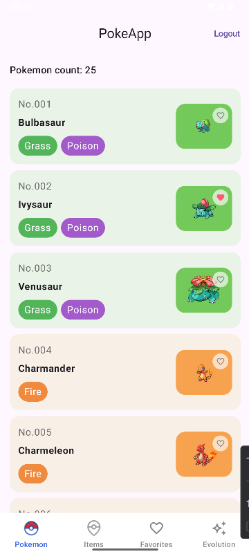
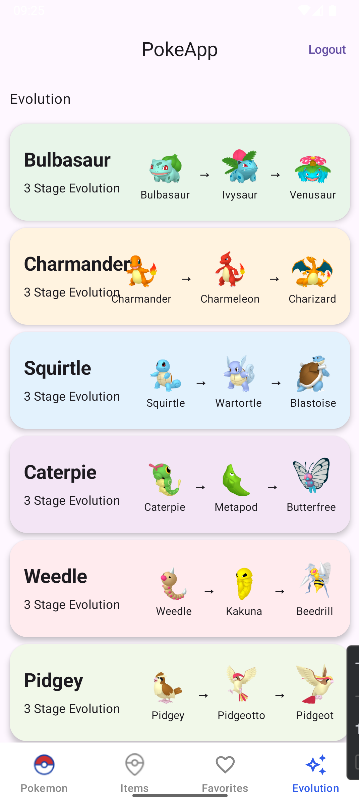
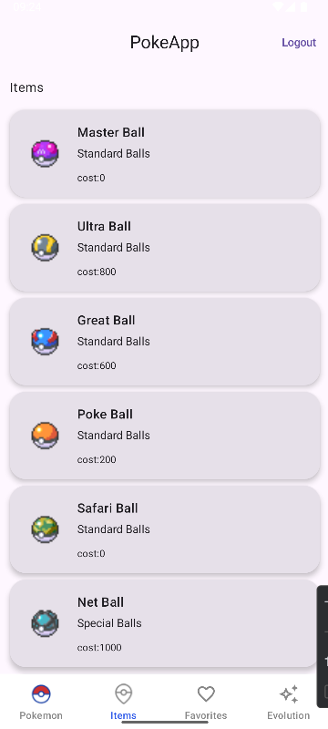
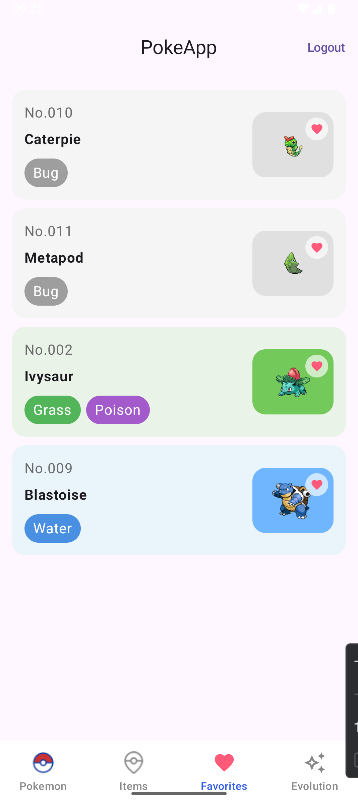
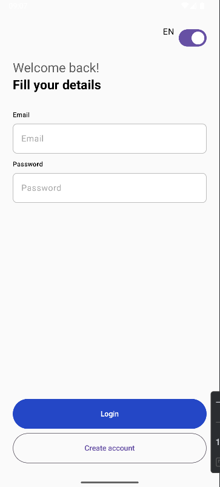
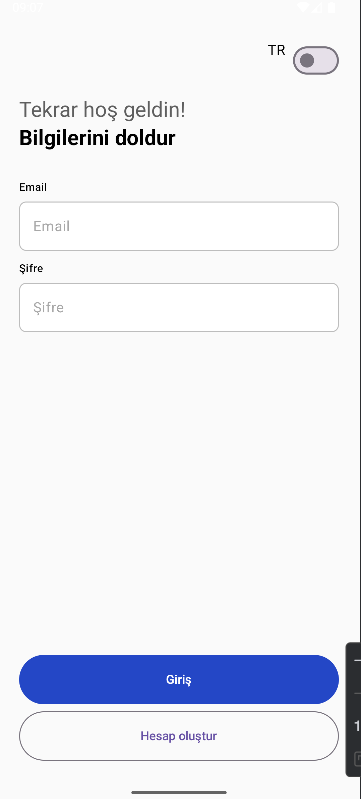
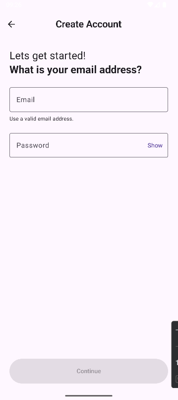

📱 PokeApp

PokeApp is an Android application that allows users to explore Pokémon, view evolution chains, browse items, and manage favorite Pokémon.

The application is built using modern Android development practices with Jetpack Compose and MVVM architecture.

🚀   Features

Browse Pokémon list

View Pokémon types

Add and remove favorite Pokémon

Explore Pokémon evolution chains

Browse Pokémon items

Multi-language support (TR / EN)

🛠 Technologies 

Kotlin

Jetpack Compose

MVVM Architecture

Hilt (Dependency Injection)

Retrofit

Kotlin Serialization

Firebase Authentication

Firebase Firestore

PokéAPI

Coil (Image Loading)

📸 Screenshots

  
 

 

 
 

🔗 API

This project uses PokéAPI
https://pokeapi.co/